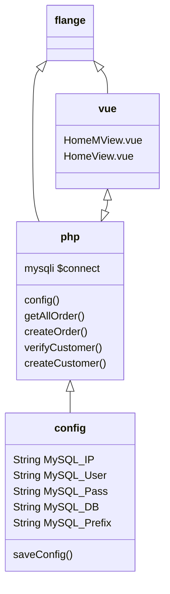

<!--
 * @Author: PlanC14 planc2333@outlook.com
 * @Date: 2022-06-06 22:46:02
 * @LastEditors: PlanC14 planc2333@outlook.com
 * @LastEditTime: 2022-08-06 17:51:22
 * @FilePath: \flange-preview\README.md
 * @Description: 这是默认设置,请设置`customMade`, 打开koroFileHeader查看配置 进行设置: https://github.com/OBKoro1/koro1FileHeader/wiki/%E9%85%8D%E7%BD%AE
-->
# flange-preview

## project graph

```sql
-- sql init
create `flange_preview`;
use `flange_preview`;

CREATE TABLE `flange` (
  `id` int NOT NULL AUTO_INCREMENT,
  `material` varchar(45) NOT NULL,
  `holes` float NOT NULL,
  `holesPadding` float NOT NULL,
  `flangeRadius` varchar(45) NOT NULL,
  `flangeThickness` float NOT NULL,
  `holesRadius` float NOT NULL,
  `centerRadius` float NOT NULL,
  `neckBottom` float NOT NULL,
  `neckTop` float NOT NULL,
  `neckHeight` float NOT NULL,
  `segments` float NOT NULL,
  `buyer` varchar(45) NOT NULL,
  `buyer_identifier` varchar(45) NOT NULL,
  `amount` int NOT NULL,
  `contact` varchar(45) NOT NULL,
  `closed` tinyint NOT NULL DEFAULT '0',
  PRIMARY KEY (`id`)
) ENGINE=InnoDB AUTO_INCREMENT=27 DEFAULT CHARSET=utf8mb3;

CREATE TABLE `flange_users` (
  `id` int NOT NULL AUTO_INCREMENT,
  `username` varchar(45) NOT NULL,
  `password` varchar(45) NOT NULL,
  `identifier` varchar(45) NOT NULL,
  PRIMARY KEY (`id`)
) ENGINE=InnoDB AUTO_INCREMENT=17 DEFAULT CHARSET=utf8mb3;
```